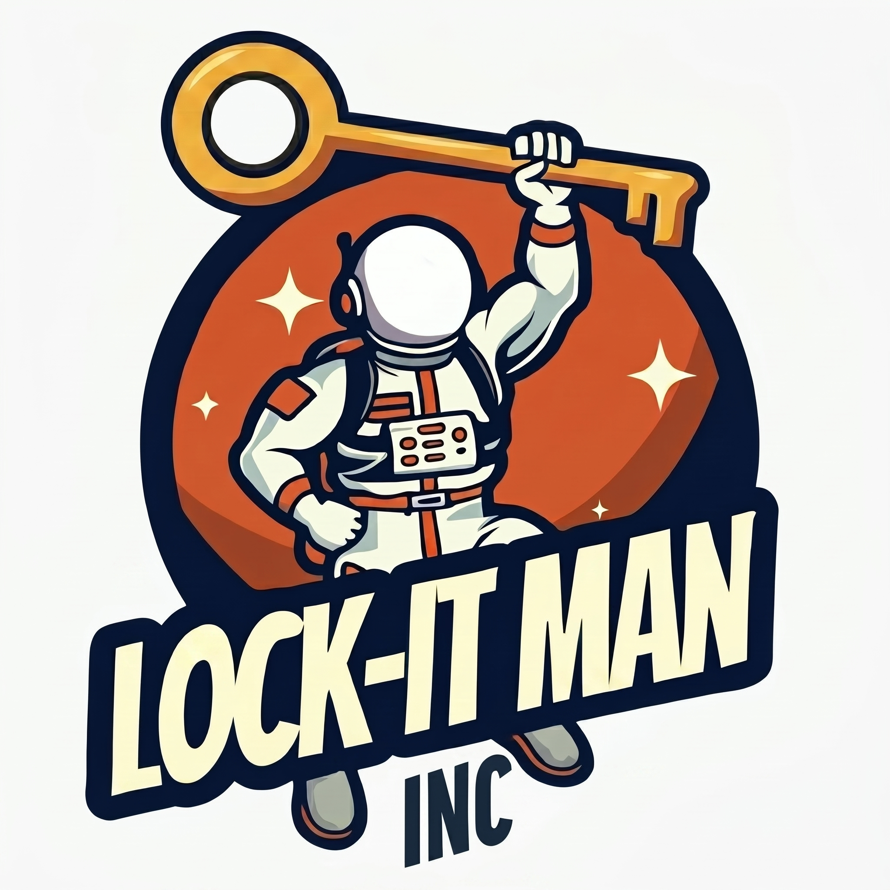

# Lock-It Man Locksmith

**Author: Joseph Goode**

<p align="left">
  
</p>

A custom mobile locksmith website built with semantic HTML, custom CSS, and vanilla JavaScript. The project focuses on responsive layout structure, clean typography, smooth interaction design, and practical service information without relying on heavy frameworks or template builders.

The site was designed and developed as a front-end build for a Central Alberta mobile locksmith business.

---

## Overview

Lock-It Man is a responsive business landing page built to feel straightforward, local, and easy to navigate. The project focuses on balancing strong visual presentation with simple service information and lightweight front-end performance.

Some of the main goals behind the build included:

- Clear service communication
- Responsive layout consistency
- Local trust-focused presentation
- Lightweight performance
- Accessible interactions
- Clean visual hierarchy

The project avoids unnecessary dependencies in favour of maintainable code, reusable spacing systems, and organized CSS structure.

---

## Features

- Semantic HTML5 structure
- Custom CSS architecture
- Responsive desktop, tablet, and mobile layouts
- BEM-inspired naming conventions
- CSS variable token system
- Responsive typography using `clamp()`
- Section-based spacing system
- Interactive Why Us carousel
- Scroll-triggered fade-in animations
- Lenis smooth scrolling integration
- Service area section with map-based visual support
- Accessible hover and focus states
- Motion accessibility support using `prefers-reduced-motion`
- Lightweight vanilla JavaScript interactions

---

## Tech Stack

- HTML5
- CSS3
- JavaScript (Vanilla)
- Lenis
- Font Awesome
- Google Fonts
- Git + GitHub
- Netlify

---

## Project Structure

```plaintext
src/
├── assets/
│   └── img/
├── scripts/
│   └── main.js
├── styles/
│   └── styles.css
```

---

## Design Notes

The layout relies heavily on spacing, typography, and contrast to create a clean and trustworthy feel across large desktop layouts and responsive breakpoints.

Animations and motion were intentionally kept subtle to support the experience without becoming distracting. Hover states, fade-ins, smooth scrolling, and carousel interactions were added gradually throughout development to improve usability and overall polish.

The CSS architecture is organized into clearly separated sections using reusable tokens and consistent naming patterns to make the project easier to maintain and expand later on.

---

## Accessibility Considerations

The project includes several accessibility-focused implementation details, including:

- Semantic heading structure
- Keyboard-friendly interactions
- Reduced motion support
- Responsive scaling
- High-contrast typography
- Accessible focus states
- Clean content hierarchy

---

## Current Development Focus

The project is still in its first working version. Current next steps include:

- Getting client feedback on the layout and content
- Replacing temporary logo files with proper SVG assets
- Refining mobile spacing and section balance
- Improving image delivery and performance where needed
- Finalizing service area (possible Google Maps API) and contact details
- Cleaning up icon usage if the project moves beyond the first review stage

---

## Live Preview

https://lock-it-man.netlify.app/

---

## Notes

- Currently in active development
- Built using VS Code and formatted with Prettier
